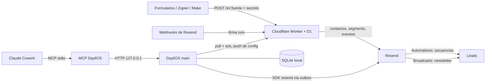

# Diseño · Email automations

## Vista general



Tres piezas:

1. **App (main)**: fuente de verdad de contactos, tags, fuentes, reglas e historial. Toda
   escritura hacia Resend pasa por una cola local (`resend_outbox`) con reintentos.
2. **Worker `leads-hub`**: siempre encendido. Recibe leads y webhooks de Resend, aplica reglas,
   escribe en Resend y encola para la app. No guarda contactos: solo la cola y la config que le
   empuja la app.
3. **Resend**: contactos, segments (uno por tag), automations (secuencias), broadcasts
   (newsletter), templates.

## Modelo de datos (SQLite)

Migración `AddMarketing1728100000000`, añadida al final del array.

`contacts` (columnas nuevas):

| columna      | tipo                    | notas                                                             |
| ------------ | ----------------------- | ----------------------------------------------------------------- |
| `name`       | text, ahora nullable    | lead sin nombre                                                   |
| `status`     | text, default `none`    | `none` · `subscribed` · `unsubscribed` · `bounced` · `complained` |
| `source`     | text null               | slug de la fuente o `manual`                                      |
| `fields`     | text JSON, default `{}` | campos libres del webhook                                         |
| `consent_at` | text null               | ISO; prueba de opt-in                                             |
| `sync_error` | text null               | último error con Resend                                           |
| `synced_at`  | text null               | última sincronización correcta                                    |

Los emails existentes se normalizan (minúsculas, vacío = null). Si hubiera duplicados, el
primero conserva el email y los demás lo pierden con una nota en `notes_md`. Después se crea el
índice único `idx_contacts_email`. SQLite permite varios `NULL` en un índice único.

Tablas nuevas:

- `tags`: `id`, `slug` (único), `name`, `segment_id` (Resend, null), `created_at`.
- `contact_tags`: `contact_id`, `tag_id` (PK compuesta), `created_at`. Índice por `tag_id`.
- `contact_events`: `id`, `contact_id`, `type`, `detail` (JSON), `created_at`. Índice
  `contact_id, created_at`.
- `lead_sources`: `id`, `slug` (único), `name`, `secret`, `default_tags` (JSON),
  `received_count`, `last_received_at`, `created_at`, `updated_at`.
- `rules`: `id`, `name`, `position`, `active`, `trigger_tag`, `actions` (JSON), `created_at`,
  `updated_at`.
- `newsletters`: `id`, `day` (YYYY-MM-DD local), `tag`, `subject`, `html`, `status`,
  `broadcast_id`, `error`, `scheduled_at`, `created_at`, `updated_at`.
- `resend_outbox`: `id`, `kind` (`contact` | `event`), `ref` (id de contacto), `payload` (JSON),
  `attempts`, `last_error`, `next_at`, `created_at`.
- `hub_receipts`: `id` (id del item de la cola del Worker), `processed_at`. Hace idempotente
  reprocesar un item si el ack se perdió.

## Código compartido (`src/shared`)

- `marketing.ts`: tipos (`ContactStatus`, `Tag`, `LeadSource`, `Rule`, `RuleAction`,
  `Newsletter`, `Sequence`…), contrato `MarketingApi`, utilidades puras: `normalizeEmail`,
  `isEmail`, `slugify`, `sourceTag`, `parseLeadPayload`, `withUnsubscribeFooter`,
  `segmentName(slug) = "tag:<slug>"`, `tagEvent(slug) = "tag.<slug>"`.
- `automation.ts`: motor de reglas puro.

  ```ts
  runRules(rules, current: string[], added: string[]): {
    tags: string[]      // tags finales
    added: string[]     // nuevos respecto a `current`
    removed: string[]
    events: string[]    // eventos de Resend a disparar (además de tag.<slug>)
    promote: string | null // etapa (id o nombre) para pasar a pipeline
  }
  ```

  Recorre los tags añadidos en anchura. Cada regla activa se dispara como mucho una vez por
  ejecución y la profundidad máxima es 5. Así un ciclo A → B → A termina.

- `resend-gateway.ts`: interfaz `ResendGateway` y su implementación con el SDK `resend`
  (la usan la app y el Worker). Respeta ~9 peticiones/s. Los tests usan un fake en memoria.

## App (main)

Servicios nuevos en `src/main/services/`, creados en `consultora.ts`:

- `contact.service` (ampliado): `list` con filtros `tag`, `status`, `source`, `query` y
  paginado; `get` con tags y línea de tiempo; `subscribe`/`unsubscribe`; `upsertLead` (el
  camino de la ingesta); `setTags(add, remove, { rules })`; `promote(ref, stage)`.
  Cada cambio relevante para Resend encola un job `contact` (uno pendiente por contacto) y,
  si el contacto está suscrito, los eventos `tag.<slug>`.
- `tag.service`: lista con número de contactos y suscritos; crear o renombrar.
- `source.service`: CRUD de fuentes; el secreto se genera con `randomBytes(24)`.
- `rule.service`: CRUD y reordenado; valida acciones.
- `marketing-sync.ts`: un tick cada 60 s, al arrancar, al despertar (`powerMonitor 'resume'`) y
  poco después de cada escritura. Sin solapes. En cada tick:
  1. **Pull** del Worker (si hay hub): `GET /admin/inbox` → aplicar cada item en una
     transacción → `POST /admin/ack` solo con lo guardado.
  2. **Push de config** si cambió (fuentes, reglas, mapa tag → segment).
  3. **Outbox** (si hay API key): procesa jobs vencidos. Un fallo suma `attempts`, guarda el
     error en el job y en `contacts.sync_error`, y reprograma con backoff (1, 5, 30 min, 2 h).
- `sequence.service`: lista y detalle de automations; `save` de una secuencia lineal (crea los
  templates, los publica y crea o actualiza la automation); `setStatus`.
- `newsletter.service`: `context`, `list`, `send` con las salvaguardas de R7.

Sincronizar un contacto (job `contact`):

1. Resolver el segment de cada tag (`ensureSegment`, busca por nombre antes de crear) y guardar
   `tags.segment_id`.
2. Buscar el contacto en Resend por email; crear o actualizar (`unsubscribed = status ≠
subscribed`).
3. Reconciliar segments: añadir los que faltan, quitar los de tags que ya no tiene (solo
   segments `tag:*`).
4. Marcar `synced_at`, borrar `sync_error`.

Los contactos con `status = none` no se sincronizan.

Ajustes nuevos en `settings.json` (0600, texto plano como la key de OpenAI): `resendApiKey`,
`fromEmail`, `fromName`, `replyTo`, `ownerEmail`, `hubUrl`, `hubAdminToken`,
`newsletterPaused`. La ventana solo ve pistas (`…a1b2`) de los secretos.

API: rutas `/marketing/*` en Express (mismo token) e IPC `marketing:*`; preload expone
`window.api.marketing`. Las herramientas MCP llaman a esas rutas.

## Worker `workers/leads-hub`

Wrangler + D1. Secretos (`wrangler secret put`): `RESEND_API_KEY`, `ADMIN_TOKEN`,
`RESEND_WEBHOOK_SECRET`.

D1:

- `config(key PRIMARY KEY, value)`: `sources` (slug → nombre, hash SHA-256 del secreto, tags por
  defecto), `rules`, `segments` (slug → id), `from` (no se usa para enviar).
- `inbox(id PRIMARY KEY, kind, payload, created_at)`.

Rutas:

- `POST /in/:source`: valida fuente (404), secreto contra el hash en tiempo constante (401),
  tamaño ≤ 64 KB (413) y payload (400). Calcula tags = origen + por defecto + payload y aplica
  `runRules`. En Resend: busca el contacto; si no existe lo crea; si está dado de baja no lo
  reactiva ni le dispara eventos; añade los segments que faltan; dispara `lead.created` (nuevo),
  `tag.<slug>` (tags que no tenía) y los eventos de reglas. Encola el item con el resultado
  (`resend.ok`, error, ids de segments creados). Responde 202 aunque Resend falle.
- `POST /resend/webhook`: verifica la firma (`resend.webhooks.verify`). `contact.updated` con
  `unsubscribed` → `unsubscribed`; `email.bounced` → `bounced`; `email.complained` →
  `complained`. Encola un item `status`.
- `GET /admin/inbox?limit=`, `POST /admin/ack { ids }`, `PUT /admin/config`, `GET /admin/health`
  con `Authorization: Bearer <ADMIN_TOKEN>`.

## Aplicar un item de la cola en la app

- `lead`: `upsertLead` por email. Nuevo → `subscribed`, `consentAt = receivedAt`, `source`.
  Existente con `none` → pasa a `subscribed` (acaba de dar su email en un formulario).
  `unsubscribed`/`bounced`/`complained` → se respeta. Aplica tags y quitados sin volver a
  evaluar reglas (ya lo hizo el Worker). Guarda los ids de segments. Si `resend.ok`, marca
  sincronizado; si no, encola el job `contact` y los eventos. Si trae `promote`, pasa a
  pipeline. Suma `received_count` de la fuente.
- `status`: cambia el estado del contacto por email y deja un evento en la línea de tiempo.

## Secuencias

Entrada de Claude (MCP `save_sequence`):

```json
{
  "name": "Webinar",
  "event": "tag.webinar",
  "emails": [{ "wait": "1 day", "subject": "…", "html": "…" }]
}
```

Se traduce a `trigger → [delay] → send_email → [delay] → send_email …` con conexiones
`default`. Cada email es un template nuevo publicado, con el pie de baja. Reescribir una
secuencia sustituye sus pasos. La app lista las automations y su disparador y enlaza a
`https://resend.com/automations/<id>`.

## Newsletter

`send({ tag, subject, html, scheduledAt? })`:

1. Pausa global → error.
2. Ya hay un newsletter hoy (día local, estado ≠ `failed`) → error.
3. El tag existe, tiene suscritos y segment (si falta, se crea y se sincronizan sus contactos
   antes; si no hay suscritos → error).
4. Pie de baja si falta.
5. Copia al dueño (`emails.send`, asunto «[Copia] …», enlace de baja inerte).
6. `broadcasts.create({ segmentId, from, replyTo, subject, html, send: true, scheduledAt })`.
7. Historial: `scheduled` o `sent`; si Resend falla, `failed` con el error.

## UI (ventana Consultora)

Sección «Contactos» ampliada y un grupo «Email» en la barra lateral: Fuentes, Reglas,
Secuencias, Newsletters. Ajustes suma «Email (Resend)» y «Hub». Dirección visual con la skill
impeccable (modo Operate), siguiendo DESIGN.md. Estados de suscripción por significado: mint =
suscrito, coral = rebote o queja, milk-soft = baja o sin marketing.

## Pruebas

- Vitest dentro de Electron (`npm test`) con SQLite en memoria y todas las migraciones reales.
- `FakeResend` en memoria para servicios, sync y newsletter.
- Worker: tests con Vitest sobre el handler, con D1 y Resend falsos.

## Riesgos

- Si el Mac duerme, la app no descarga leads, pero el Worker y Resend siguen: los leads reciben
  su secuencia igual.
- Las tareas programadas de Claude Cowork corren con el Mac despierto.
- Secretos en texto plano (0600). Aceptable para un único usuario; Keychain queda fuera.
